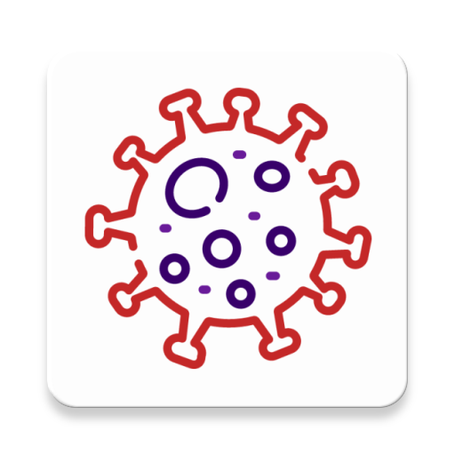
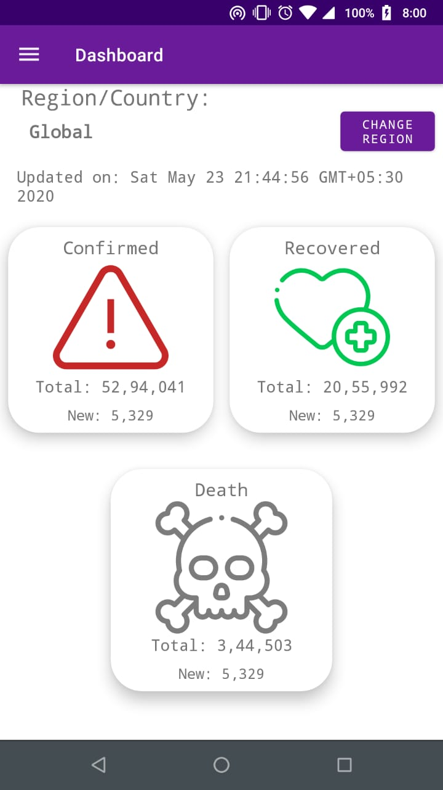
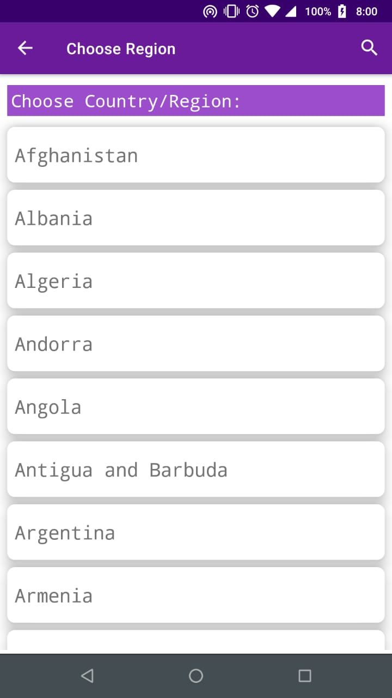
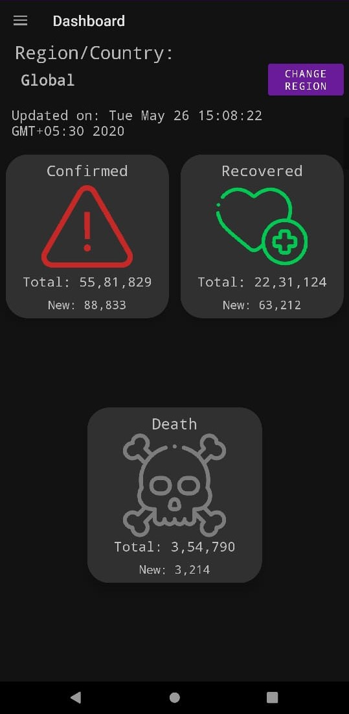

<p align="center">
  
</p>

# Covid-19 Dashboard

[](LICENSE)


**Covid-19 Dashboard** is a simple Android application 📱 which shows the current case counts of various countries and also global case counts. It is built using *Modern Android development* tools. Dedicated to all Android Developers with ❤️. 


<table style="width:100%">
  <tr>
    <th>Main Screen</th>
    <th>Region List Screen</th>
    <th>Main Screen (Dark Mode 🌗)</th>
  </tr>
  <tr>
    <td></td>
    <td></td>
    <td></td>
  </tr>
</table>

## About
- It simply loads **Total and New Confirmed cases, Recoverd cases and Deaths** from [API](https://covid19api.com/). 
- It supports dark mode too 🌗.
- It is offline capable (Locally stored using Room).


## Built With 🛠
- [Kotlin](https://kotlinlang.org/) - First class and official programming language for Android development.
- [Coroutines](https://kotlinlang.org/docs/reference/coroutines-overview.html) - For asynchronous stuffs.
- [Android Architecture Components](https://developer.android.com/topic/libraries/architecture) - Collection of libraries that help you design robust, testable, and maintainable apps.
  - [LiveData](https://developer.android.com/topic/libraries/architecture/livedata) - Data objects that notify views when the underlying database changes.
  - [ViewModel](https://developer.android.com/topic/libraries/architecture/viewmodel) - Stores UI-related data that isn't destroyed on UI changes. 
  - [ViewBinding](https://developer.android.com/topic/libraries/view-binding) - Generates a binding class for each XML layout file present in that module and allows you to more easily write code that interacts with views.
  - [Room Persistence Library](https://developer.android.com/topic/libraries/architecture/room) - The Room persistence library provides an abstraction layer over SQLite to allow for more robust database access while harnessing the full power of SQLite.
- [Retrofit](https://square.github.io/retrofit/) - A type-safe HTTP client for Android and Java.
- [Moshi](https://github.com/square/moshi) - A modern JSON library for Kotlin and Java.
- [Moshi Converter](https://github.com/square/retrofit/tree/master/retrofit-converters/moshi) - A Converter which uses Moshi for serialization to and from JSON.
- [WorkManager](https://developer.android.com/topic/libraries/architecture/workmanager) - The WorkManager API makes it easy to schedule deferrable, asynchronous tasks that are expected to run even if the app exits or device restarts.
- [Material Components for Android](https://github.com/material-components/material-components-android) - Modular and customizable Material Design UI components for Android

# Package Structure
    
    dev.kingominho.covid_19dashboard    # Root Package
    .
    ├── database                  # Database entites and Database classes and database interface
    ├── domain                    # data classes for using in views
    ├── network                   # API service and network classes
    ├── repository                # Repository to handle data from network and local dabase
    |
    ├── ui                        # Activity and Fragments/View layer  
    │   ├── about                 # About screen and supporting classes
    │   ├── dashboard             # Dashboard screen and supporting classes
    │   └── regionList            # Region List screen and supporting classes
    ├── util                      # Utility Classes / Kotlin extensions
    ├── viewmodel                 # App viewmodel
    └── worker                    # Worker class.


## Credits
Thanks to 
- [covid19api.com](https://covid19api.com/) for API.
- [Coding in Flow](https://codinginflow.com/) - for his awesome tutorials on Android Development.
- [Android Kotlin Fundementals](https://codelabs.developers.google.com/android-kotlin-fundamentals/) - for awesome Codelabs on using Kotlin to build Andorid apps using best practices.

## Attributions

- All icons: <div>made by <a href="https://www.flaticon.com/authors/freepik" title="Freepik">Freepik</a> from <a href="https://www.flaticon.com/" title="Flaticon">www.flaticon.com</a></div>


## License
```
MIT License

Copyright (c) 2020 Debaleen Das Spandan

Permission is hereby granted, free of charge, to any person obtaining a copy
of this software and associated documentation files (the "Software"), to deal
in the Software without restriction, including without limitation the rights
to use, copy, modify, merge, publish, distribute, sublicense, and/or sell
copies of the Software, and to permit persons to whom the Software is
furnished to do so, subject to the following conditions:

The above copyright notice and this permission notice shall be included in all
copies or substantial portions of the Software.

THE SOFTWARE IS PROVIDED "AS IS", WITHOUT WARRANTY OF ANY KIND, EXPRESS OR
IMPLIED, INCLUDING BUT NOT LIMITED TO THE WARRANTIES OF MERCHANTABILITY,
FITNESS FOR A PARTICULAR PURPOSE AND NONINFRINGEMENT. IN NO EVENT SHALL THE
AUTHORS OR COPYRIGHT HOLDERS BE LIABLE FOR ANY CLAIM, DAMAGES OR OTHER
LIABILITY, WHETHER IN AN ACTION OF CONTRACT, TORT OR OTHERWISE, ARISING FROM,
OUT OF OR IN CONNECTION WITH THE SOFTWARE OR THE USE OR OTHER DEALINGS IN THE
SOFTWARE.
```
